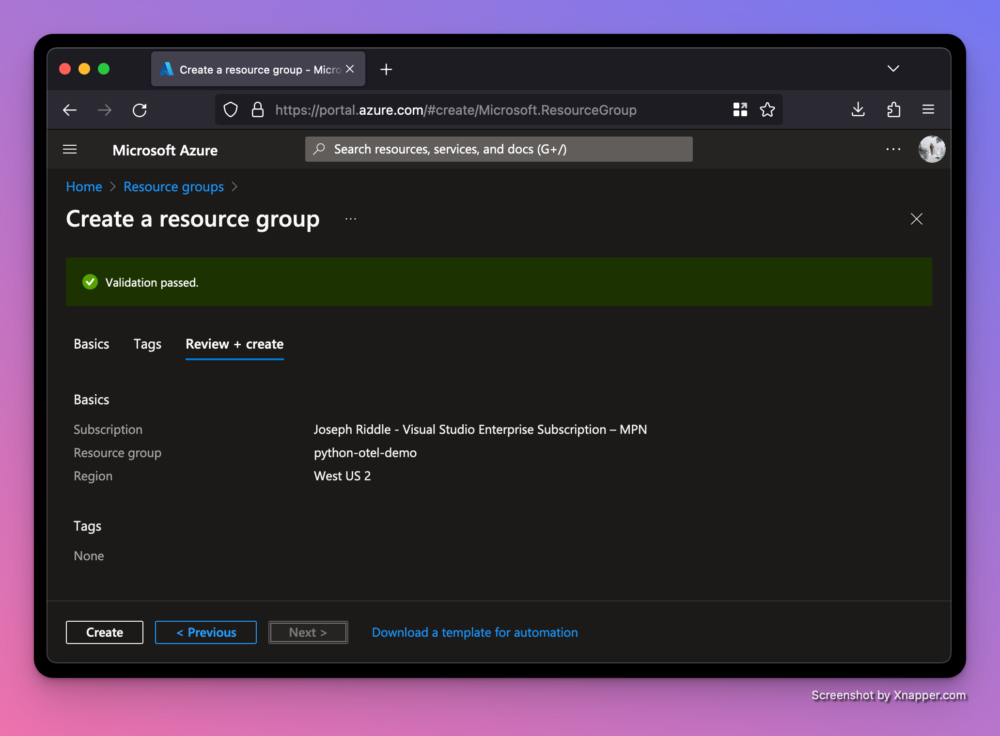

# OpenTelemetry and Python

## Intro to OTel

Designing a software application to be observable is table stakes in modern software development. Observability is a non-functional requirement that when done right enables the state of a system to be continuously communicated and visible to those maintaining it. Because observability is a non-functional requirement, it has more to do with the way the system is designed than any specific feature.

The modern path to making a software system more observable is to begin with the three pillars of observability: **logs**, **metrics**, and **traces**.
### Logs
You're probably already familiar with logs; logging can be as simple as a `print` statement or using the Python standard library's `logging` package:

```python
import logging

def get_foo():
	logging.info("foo has been gotten")
	return "foo"
```

### Traces
Traces are provide context as a request works it through a microservice architecture. They use a randomly generated unique ID to track events from various microservices while maintaining shared context. Traces can be visualized using a flamegraph or icicle chart:


### Metrics
With metrics, we can measure the performance of the system over varying periods of time. In this article we are going to focus on setting up metrics with a basic Python web server.

The amount of products that deal with metrics is dizzying. A few of the more important ones in this space are:
- [OpenTelemetry](https://opentelemetry.io/): a vendor-agnostic standard for handling metrics, logs, and traces.
- [Prometheus](https://prometheus.io/): a monitoring system and time series database.
- [Grafana](https://grafana.com/): an open source analytics an monitoring solution with a focus on charts and alerts.

All major cloud providers provide their own metric solution:
- [Azure Monitor Metrics](https://learn.microsoft.com/en-us/azure/azure-monitor/essentials/data-platform-metrics)
- [AWS CloudWatch Metrics](https://docs.aws.amazon.com/AmazonCloudWatch/latest/monitoring/working_with_metrics.html)
- [GCP Cloud Monitoring Metrics](https://cloud.google.com/monitoring/api/metrics_gcp)

## Build basic app using [FastAPI](https://fastapi.tiangolo.com/#example)

[FastAPI](https://fastapi.tiangolo.com/) is one of the most popular Python web frameworks. It utilizes modern Python features like type hints to provide a world-class developer experience. It is more similar to its older sibling [Flask](https://flask.palletsprojects.com/en/3.0.x/) than [Django](https://www.djangoproject.com/) (the [two most popular Python web frameworks](https://lp.jetbrains.com/python-developers-survey-2022/#FrameworksLibraries)).

Let's create a simple FastAPI application. All code samples can be found on GitHub at [joeriddles/python-otel-demo](https://github.com/joeriddles/python-otel-demo/).

First, let's create a virtual environment, activate it, and install FastAPI. Note we also need to an ASGI ("asynchronous server gateway interface"... if that doesn't mean anything to you, consider checking out the [ASGI docs](https://asgi.readthedocs.io/en/latest/)). In this case, we'll use [uvicorn](https://www.uvicorn.org/).
```shell
$ python3 -m venv .venv
$ source .venv/bin/activate
$ pip install fastapi==0.105.0 uvicorn==0.24.0
```

Next, let's write a basic app in your code editor of choice (I prefer [VS Code](https://code.visualstudio.com/) for Python):
```python
import random

from fastapi import FastAPI
from fastapi.responses import HTMLResponse

app = FastAPI()


@app.get("/{name}/")
def get_naughty_or_nice(name: str):
	naughty_or_nice = "naughty" if bool(random.randint(0, 1)) else "nice"
	return HTMLResponse(f"{name}, you have been very {naughty_or_nice} this year!")
```

To start the web server, open a terminal and run:
```shell
$ uvicorn main:app
INFO:     Started server process [14528]
INFO:     Waiting for application startup.
INFO:     Application startup complete.
INFO:     Uvicorn running on http://127.0.0.1:8000 (Press CTRL+C to quit)
```

We should see that sometimes we've been nice and sometimes we've been naughty (**cough** [Mitch](https://intellitect.com/blog/author/mitch-rickman/)):


## Automatic instrumentation
Now that we have a basic app we can work with, let's set about getting our first metrics. The easiest way to add metrics when you are starting from scratch is to using [automatic instrumentation](https://opentelemetry.io/docs/instrumentation/python/automatic/).

Fortunately, OpenTelemetry provides a distro for bootstrapping automatic instrumentation. The distro analyzes our code to determine what packages we're using and automatically hooks in at runtime. The `opentelemetry-instrument` command injects bytecode for instrumentation and then runs the program (`uvicorn main:app`). Our options to the command include:
- `--traces_exporter none`: disables exporting [traces](https://opentelemetry.io/docs/concepts/signals/traces/) because we're focused on metrics
- `--metrics_exporter console`: prints the metrics info to the console
- `--metric_export_interval 5000`: print the metrics every 5,000 ms (5 seconds).
- `--service_name main`: 

```shell
$ pip install opentelemetry-distro==0.42b0 opentelemetry-instrumentation-fastapi==0.42b0
$ export OTEL_PYTHON_LOGGING_AUTO_INSTRUMENTATION_ENABLED=true
$ opentelemetry-instrument \
  --traces_exporter none \
  --metrics_exporter console \
  --metric_export_interval 5000 \
  --service_name main \
  uvicorn main:app
```

---

Aside: `opentelemetry-bootstrap -a install`

Note the docs recommend using `opentelemetry-bootstrap -a install`, but in my experience this installs a lot of unnecessary packages:
```shell
$ opentelemetry-bootstrap -a install
$ pip freeze | grep opentelemetry
opentelemetry-api==1.21.0
opentelemetry-distro==0.42b0
opentelemetry-exporter-otlp==1.21.0
opentelemetry-exporter-otlp-proto-common==1.21.0
opentelemetry-exporter-otlp-proto-grpc==1.21.0
opentelemetry-exporter-otlp-proto-http==1.21.0
opentelemetry-instrumentation==0.42b0
opentelemetry-instrumentation-asgi==0.42b0
opentelemetry-instrumentation-aws-lambda==0.42b0
opentelemetry-instrumentation-dbapi==0.42b0
opentelemetry-instrumentation-fastapi==0.42b0
opentelemetry-instrumentation-grpc==0.42b0
opentelemetry-instrumentation-logging==0.42b0
opentelemetry-instrumentation-requests==0.42b0
opentelemetry-instrumentation-sqlite3==0.42b0
opentelemetry-instrumentation-tortoiseorm==0.42b0
opentelemetry-instrumentation-urllib==0.42b0
opentelemetry-instrumentation-urllib3==0.42b0
opentelemetry-instrumentation-wsgi==0.42b0
opentelemetry-propagator-aws-xray==1.0.1
opentelemetry-proto==1.21.0
opentelemetry-sdk==1.21.0
opentelemetry-semantic-conventions==0.42b0
opentelemetry-util-http==0.42b0
```

We aren't using most of the packages these OTel packages wrap, so there's no reason to install the OTel packages.

---

After refreshing our web page in the browser a few times, we should start seeing metrics reported in the console:
```
{
    "resource_metrics": [
        {
            "resource": {
                "attributes": {
                    "telemetry.sdk.language": "python",
                    "telemetry.sdk.name": "opentelemetry",
                    "telemetry.sdk.version": "1.21.0",
                    "service.name": "main",
                    "telemetry.auto.version": "0.42b0"
                },
                "schema_url": ""
            },
            "scope_metrics": [
                {
                    "scope": {
                        "name": "opentelemetry.instrumentation.fastapi",
                        "version": "0.42b0",
                        "schema_url": "https://opentelemetry.io/schemas/1.11.0"
                    },
                    "metrics": [
                        {
                            "name": "http.server.active_requests",
                            "description": "measures the number of concurrent HTTP requests that are currently in-flight",
                            "unit": "requests",
                            "data": {
                                "data_points": [
                                    {
                                        "attributes": {
                                            "http.host": "127.0.0.1:8000",
                                            "http.flavor": "1.1",
                                            "http.method": "GET",
                                            "http.scheme": "http",
                                            "http.server_name": "127.0.0.1:8000"
                                        },
                                        "start_time_unix_nano": 1702933388063895000,
                                        "time_unix_nano": 1702933394704893000,
                                        "value": 0
                                    }
                                ],
                                "aggregation_temporality": 2,
                                "is_monotonic": false
                            }
                        },
                        {
                            "name": "http.server.duration",
                            "description": "measures the duration of the inbound HTTP request",
                            "unit": "ms",
                            "data": {
                                "data_points": [
                                    {
                                        "attributes": {
                                            "http.host": "127.0.0.1:8000",
                                            "net.host.port": 8000,
                                            "http.flavor": "1.1",
                                            "http.method": "GET",
                                            "http.scheme": "http",
                                            "http.server_name": "127.0.0.1:8000",
                                            "http.status_code": 200,
                                            "http.target": "/{name}/"
                                        },
                                        "start_time_unix_nano": 1702933388072389000,
                                        "time_unix_nano": 1702933394704893000,
                                        "count": 75,
                                        "sum": 185,
                                        "bucket_counts": [
                                            0, 73, 1, 1, 0, 0, 0, 0, 0, 0, 0, 0, 0, 0, 0, 0
                                        ],
                                        "explicit_bounds": [
                                            0.0, 5.0, 10.0, 25.0, 50.0, 75.0, 100.0, 250.0, 500.0, 750.0, 1000.0, 2500.0, 5000.0, 7500.0, 10000.0
                                        ],
                                        "min": 1,
                                        "max": 14
                                    }
                                ],
                                "aggregation_temporality": 2
                            }
                        },
                        {
                            "name": "http.server.response.size",
                            "description": "measures the size of HTTP response messages (compressed).",
                            "unit": "By",
                            "data": {
                                "data_points": [
                                    {
                                        "attributes": {
                                            "http.host": "127.0.0.1:8000",
                                            "net.host.port": 8000,
                                            "http.flavor": "1.1",
                                            "http.method": "GET",
                                            "http.scheme": "http",
                                            "http.server_name": "127.0.0.1:8000",
                                            "http.status_code": 200,
                                            "http.target": "/{name}/"
                                        },
                                        "start_time_unix_nano": 1702933388072536000,
                                        "time_unix_nano": 1702933394704893000,
                                        "count": 75,
                                        "sum": 3039,
                                        "bucket_counts": [
                                            0, 0, 0, 0, 75, 0, 0, 0, 0, 0, 0, 0, 0, 0, 0, 0
                                        ],
                                        "explicit_bounds": [
                                            0.0, 5.0, 10.0, 25.0, 50.0, 75.0, 100.0, 250.0, 500.0, 750.0, 1000.0, 2500.0, 5000.0, 7500.0, 10000.0
                                        ],
                                        "min": 39,
                                        "max": 42
                                    }
                                ],
                                "aggregation_temporality": 2
                            }
                        }
                    ],
                    "schema_url": "https://opentelemetry.io/schemas/1.11.0"
                }
            ],
            "schema_url": ""
        }
    ]
}
```


- https://opentelemetry.io/docs/instrumentation/python/automatic/
- https://opentelemetry.io/docs/instrumentation/python/distro/
- https://github.com/open-telemetry/opentelemetry-python-contrib/tree/main/opentelemetry-instrumentation#opentelemetry-bootstrap
- https://opentelemetry-python.readthedocs.io/en/stable/index.html#integrations
- "opentelemetry-instrument automatically instruments a Python program and its dependencies and then runs the program."

## Start local [OTel collector](https://opentelemetry.io/docs/collector/getting-started/)

Right now we're just dumping our metrics information the console but we really want to export it to an [OTel collector](https://opentelemetry.io/docs/collector/getting-started/). OTel collectors receive telemetry data, process it, and then export it to OTel backends.

It is possible to get by without a collector (as we'll see later), but generally not recommended. The main benefit of skipping a collector is a simpler setup, but it tightly couples your application to the OTel backend. Collectors are often ran as sidecar processes in Kubernetes pods.

Let's spin up a local collector. We'll use Docker containers to easily start the collector and other services that depend on it.

First, let's define a docker compose config:
```yaml
services:
  collector:
    image: otel/opentelemetry-collector-contrib:0.91.0
    command: ["--config=/etc/otel-collector-config.yml"]
    volumes:
      - "./otel-collector-config.yml:/etc/otel-collector-config.yml"
    ports:
      - "4317:4317"   # OTLP over gRPC
      - "4318:4318"   # OTLP over HTTP
      - "55679:55679" # zPages
      - "13133:13133" # health check
    healthcheck:
      test: ["CMD", "curl", "--fail", "localhost:13133"]
      interval: 10s
      timeout: 1s
      retries: 5
      start_period: 10s
```

We're mounting a local `otel-collector-config.yml` file, so we'll need to create that as well:

```yaml
receivers:
  otlp:
    protocols:
      http:
        cors:
          allowed_origins:
            - "*"

processors:
  batch:

exporters:
  debug:
    verbosity: detailed

extensions:
  health_check:
  zpages:

service:
  extensions: [health_check, zpages]
  pipelines:
    metrics:
      receivers: [otlp]
      processors: [batch]
      exporters: [debug]
```

We've configured our collector to:
- receive data via the [OpenTelemetry Protocol](https://opentelemetry.io/docs/specs/otel/protocol/) protocol using HTTP (not gRPC)
- process the incoming metrics in [batches](https://github.com/open-telemetry/opentelemetry-collector/blob/main/processor/batchprocessor/README.md)
- export the processed metrics to the console

Other collector config options can be found here: https://opentelemetry.io/docs/collector/configuration/.

We've also enabled two extensions. [zPages](https://github.com/open-telemetry/opentelemetry-collector/blob/main/extension/zpagesextension/README.md) provides web UI for debugging the collector and its components. Some of the available zPages URLs include http://localhost:55679/debug/servicez and http://localhost:55679/debug/tracez. [Health Check](https://github.com/open-telemetry/opentelemetry-collector-contrib/blob/main/extension/healthcheckextension/README.md) adds an HTTP endpoint that can be used for checking liveness of the collector. We're using it in our Docker Compose config to monitor the container.

Start the container:
```shell
docker compose up
```

In another terminal we'll launch our web server. This time it will export to the OTel collector instead of printing straight to the console:
```shell
$ export OTEL_PYTHON_LOGGING_AUTO_INSTRUMENTATION_ENABLED=true
$ opentelemetry-instrument \
  --traces_exporter none \
  --metrics_exporter otlp \
  --metric_export_interval 5000 \
  --exporter_otlp_protocol 'http/protobuf' \
  --exporter_otlp_endpoint 'http://localhost:4318' \
  --service_name main \
  uvicorn main:app
```

Refresh your web page a few times and we should see some logs from the collector container:
```
otel-demo-collector-1  | 2023-12-18T21:32:24.043Z       info    ResourceSpans #0
otel-demo-collector-1  | Resource SchemaURL: 
otel-demo-collector-1  | Resource attributes:
otel-demo-collector-1  |      -> telemetry.sdk.language: Str(python)
otel-demo-collector-1  |      -> telemetry.sdk.name: Str(opentelemetry)
otel-demo-collector-1  |      -> telemetry.sdk.version: Str(1.21.0)
otel-demo-collector-1  |      -> service.name: Str(main)
otel-demo-collector-1  |      -> telemetry.auto.version: Str(0.42b0)
otel-demo-collector-1  | ScopeSpans #0
otel-demo-collector-1  | ScopeSpans SchemaURL: 
otel-demo-collector-1  | InstrumentationScope tracer 
otel-demo-collector-1  | Span #0
otel-demo-collector-1  |     Trace ID       : b340194df7dadc841c77c8dd2ff6a9b1
otel-demo-collector-1  |     Parent ID      : 3a040cad0c0c7b0b
otel-demo-collector-1  |     ID             : a4d8c3577908231f
otel-demo-collector-1  |     Name           : get_naughty_or_nice
otel-demo-collector-1  |     Kind           : Internal
otel-demo-collector-1  |     Start time     : 2023-12-18 21:32:23.390233 +0000 UTC
otel-demo-collector-1  |     End time       : 2023-12-18 21:32:23.390338 +0000 UTC
otel-demo-collector-1  |     Status code    : Unset
otel-demo-collector-1  |     Status message : 
otel-demo-collector-1  | Attributes:
otel-demo-collector-1  |      -> naughty_or_nice: Str(nice)
otel-demo-collector-1  | Span #1
otel-demo-collector-1  |     Trace ID       : d07e2919bd947b85989737c0078c4b15
otel-demo-collector-1  |     Parent ID      : 886f3452f6252301
otel-demo-collector-1  |     ID             : 9a48f0beb4ea002f
otel-demo-collector-1  |     Name           : get_naughty_or_nice
otel-demo-collector-1  |     Kind           : Internal
otel-demo-collector-1  |     Start time     : 2023-12-18 21:32:23.530726 +0000 UTC
otel-demo-collector-1  |     End time       : 2023-12-18 21:32:23.530749 +0000 UTC
otel-demo-collector-1  |     Status code    : Unset
otel-demo-collector-1  |     Status message : 
otel-demo-collector-1  | Attributes:
otel-demo-collector-1  |      -> naughty_or_nice: Str(nice)
otel-demo-collector-1  | ScopeSpans #1
otel-demo-collector-1  | ScopeSpans SchemaURL: 
otel-demo-collector-1  | InstrumentationScope opentelemetry.instrumentation.asgi 0.42b0
otel-demo-collector-1  | Span #0
otel-demo-collector-1  |     Trace ID       : b340194df7dadc841c77c8dd2ff6a9b1
otel-demo-collector-1  |     Parent ID      : 3a040cad0c0c7b0b
otel-demo-collector-1  |     ID             : e26884cea4b3b892
otel-demo-collector-1  |     Name           : GET /{name}/ http send
otel-demo-collector-1  |     Kind           : Internal
otel-demo-collector-1  |     Start time     : 2023-12-18 21:32:23.390718 +0000 UTC
otel-demo-collector-1  |     End time       : 2023-12-18 21:32:23.391184 +0000 UTC
otel-demo-collector-1  |     Status code    : Unset
otel-demo-collector-1  |     Status message : 
otel-demo-collector-1  | Attributes:
otel-demo-collector-1  |      -> http.status_code: Int(200)
otel-demo-collector-1  |      -> type: Str(http.response.start)
otel-demo-collector-1  | Span #1
otel-demo-collector-1  |     Trace ID       : b340194df7dadc841c77c8dd2ff6a9b1
otel-demo-collector-1  |     Parent ID      : 3a040cad0c0c7b0b
otel-demo-collector-1  |     ID             : 5769f5612428ca53
otel-demo-collector-1  |     Name           : GET /{name}/ http send
otel-demo-collector-1  |     Kind           : Internal
otel-demo-collector-1  |     Start time     : 2023-12-18 21:32:23.391314 +0000 UTC
otel-demo-collector-1  |     End time       : 2023-12-18 21:32:23.39148 +0000 UTC
otel-demo-collector-1  |     Status code    : Unset
otel-demo-collector-1  |     Status message : 
otel-demo-collector-1  | Attributes:
otel-demo-collector-1  |      -> type: Str(http.response.body)
otel-demo-collector-1  | Span #2
otel-demo-collector-1  |     Trace ID       : b340194df7dadc841c77c8dd2ff6a9b1
otel-demo-collector-1  |     Parent ID      : 
otel-demo-collector-1  |     ID             : 3a040cad0c0c7b0b
otel-demo-collector-1  |     Name           : GET /{name}/
otel-demo-collector-1  |     Kind           : Server
otel-demo-collector-1  |     Start time     : 2023-12-18 21:32:23.385089 +0000 UTC
otel-demo-collector-1  |     End time       : 2023-12-18 21:32:23.391529 +0000 UTC
otel-demo-collector-1  |     Status code    : Unset
otel-demo-collector-1  |     Status message : 
otel-demo-collector-1  | Attributes:
otel-demo-collector-1  |      -> http.scheme: Str(http)
otel-demo-collector-1  |      -> http.host: Str(127.0.0.1:8000)
otel-demo-collector-1  |      -> net.host.port: Int(8000)
otel-demo-collector-1  |      -> http.flavor: Str(1.1)
otel-demo-collector-1  |      -> http.target: Str(/Joe/)
otel-demo-collector-1  |      -> http.url: Str(http://127.0.0.1:8000/Joe/)
otel-demo-collector-1  |      -> http.method: Str(GET)
otel-demo-collector-1  |      -> http.server_name: Str(127.0.0.1:8000)
otel-demo-collector-1  |      -> http.user_agent: Str(Mozilla/5.0 (Macintosh; Intel Mac OS X 10.15; rv:120.0) Gecko/20100101 Firefox/120.0)
otel-demo-collector-1  |      -> net.peer.ip: Str(127.0.0.1)
otel-demo-collector-1  |      -> net.peer.port: Int(55750)
otel-demo-collector-1  |      -> http.route: Str(/{name}/)
otel-demo-collector-1  |      -> http.status_code: Int(200)
otel-demo-collector-1  | Span #3
otel-demo-collector-1  |     Trace ID       : d07e2919bd947b85989737c0078c4b15
otel-demo-collector-1  |     Parent ID      : 886f3452f6252301
otel-demo-collector-1  |     ID             : 87ce1dc00c797c8d
otel-demo-collector-1  |     Name           : GET /{name}/ http send
otel-demo-collector-1  |     Kind           : Internal
otel-demo-collector-1  |     Start time     : 2023-12-18 21:32:23.531006 +0000 UTC
otel-demo-collector-1  |     End time       : 2023-12-18 21:32:23.531192 +0000 UTC
otel-demo-collector-1  |     Status code    : Unset
otel-demo-collector-1  |     Status message : 
otel-demo-collector-1  | Attributes:
otel-demo-collector-1  |      -> http.status_code: Int(200)
otel-demo-collector-1  |      -> type: Str(http.response.start)
otel-demo-collector-1  | Span #4
otel-demo-collector-1  |     Trace ID       : d07e2919bd947b85989737c0078c4b15
otel-demo-collector-1  |     Parent ID      : 886f3452f6252301
otel-demo-collector-1  |     ID             : 0404030cb802fbff
otel-demo-collector-1  |     Name           : GET /{name}/ http send
otel-demo-collector-1  |     Kind           : Internal
otel-demo-collector-1  |     Start time     : 2023-12-18 21:32:23.531218 +0000 UTC
otel-demo-collector-1  |     End time       : 2023-12-18 21:32:23.531272 +0000 UTC
otel-demo-collector-1  |     Status code    : Unset
otel-demo-collector-1  |     Status message : 
otel-demo-collector-1  | Attributes:
otel-demo-collector-1  |      -> type: Str(http.response.body)
otel-demo-collector-1  | Span #5
otel-demo-collector-1  |     Trace ID       : d07e2919bd947b85989737c0078c4b15
otel-demo-collector-1  |     Parent ID      : 
otel-demo-collector-1  |     ID             : 886f3452f6252301
otel-demo-collector-1  |     Name           : GET /{name}/
otel-demo-collector-1  |     Kind           : Server
otel-demo-collector-1  |     Start time     : 2023-12-18 21:32:23.530485 +0000 UTC
otel-demo-collector-1  |     End time       : 2023-12-18 21:32:23.531281 +0000 UTC
otel-demo-collector-1  |     Status code    : Unset
otel-demo-collector-1  |     Status message : 
otel-demo-collector-1  | Attributes:
otel-demo-collector-1  |      -> http.scheme: Str(http)
otel-demo-collector-1  |      -> http.host: Str(127.0.0.1:8000)
otel-demo-collector-1  |      -> net.host.port: Int(8000)
otel-demo-collector-1  |      -> http.flavor: Str(1.1)
otel-demo-collector-1  |      -> http.target: Str(/Joe/)
otel-demo-collector-1  |      -> http.url: Str(http://127.0.0.1:8000/Joe/)
otel-demo-collector-1  |      -> http.method: Str(GET)
otel-demo-collector-1  |      -> http.server_name: Str(127.0.0.1:8000)
otel-demo-collector-1  |      -> http.user_agent: Str(Mozilla/5.0 (Macintosh; Intel Mac OS X 10.15; rv:120.0) Gecko/20100101 Firefox/120.0)
otel-demo-collector-1  |      -> net.peer.ip: Str(127.0.0.1)
otel-demo-collector-1  |      -> net.peer.port: Int(55750)
otel-demo-collector-1  |      -> http.route: Str(/{name}/)
otel-demo-collector-1  |      -> http.status_code: Int(200)
otel-demo-collector-1  |        {"kind": "exporter", "data_type": "traces", "name": "debug"}
otel-demo-collector-1  | 2023-12-18T21:32:24.043Z       info    ResourceMetrics #0
otel-demo-collector-1  | Resource SchemaURL: 
otel-demo-collector-1  | Resource attributes:
otel-demo-collector-1  |      -> telemetry.sdk.language: Str(python)
otel-demo-collector-1  |      -> telemetry.sdk.name: Str(opentelemetry)
otel-demo-collector-1  |      -> telemetry.sdk.version: Str(1.21.0)
otel-demo-collector-1  |      -> service.name: Str(main)
otel-demo-collector-1  |      -> telemetry.auto.version: Str(0.42b0)
otel-demo-collector-1  | ScopeMetrics #0
otel-demo-collector-1  | ScopeMetrics SchemaURL: 
otel-demo-collector-1  | InstrumentationScope opentelemetry.instrumentation.fastapi 0.42b0
otel-demo-collector-1  | Metric #0
otel-demo-collector-1  | Descriptor:
otel-demo-collector-1  |      -> Name: http.server.active_requests
otel-demo-collector-1  |      -> Description: measures the number of concurrent HTTP requests that are currently in-flight
otel-demo-collector-1  |      -> Unit: requests
otel-demo-collector-1  |      -> DataType: Sum
otel-demo-collector-1  |      -> IsMonotonic: false
otel-demo-collector-1  |      -> AggregationTemporality: Cumulative
otel-demo-collector-1  | NumberDataPoints #0
otel-demo-collector-1  | Data point attributes:
otel-demo-collector-1  |      -> http.server_name: Str(127.0.0.1:8000)
otel-demo-collector-1  |      -> http.method: Str(GET)
otel-demo-collector-1  |      -> http.flavor: Str(1.1)
otel-demo-collector-1  |      -> http.host: Str(127.0.0.1:8000)
otel-demo-collector-1  |      -> http.scheme: Str(http)
otel-demo-collector-1  | StartTimestamp: 2023-12-18 21:32:23.385188 +0000 UTC
otel-demo-collector-1  | Timestamp: 2023-12-18 21:32:23.950872 +0000 UTC
otel-demo-collector-1  | Value: 0
otel-demo-collector-1  | Metric #1
otel-demo-collector-1  | Descriptor:
otel-demo-collector-1  |      -> Name: http.server.duration
otel-demo-collector-1  |      -> Description: measures the duration of the inbound HTTP request
otel-demo-collector-1  |      -> Unit: ms
otel-demo-collector-1  |      -> DataType: Histogram
otel-demo-collector-1  |      -> AggregationTemporality: Cumulative
otel-demo-collector-1  | HistogramDataPoints #0
otel-demo-collector-1  | Data point attributes:
otel-demo-collector-1  |      -> net.host.port: Int(8000)
otel-demo-collector-1  |      -> http.server_name: Str(127.0.0.1:8000)
otel-demo-collector-1  |      -> http.method: Str(GET)
otel-demo-collector-1  |      -> http.flavor: Str(1.1)
otel-demo-collector-1  |      -> http.host: Str(127.0.0.1:8000)
otel-demo-collector-1  |      -> http.scheme: Str(http)
otel-demo-collector-1  |      -> http.status_code: Int(200)
otel-demo-collector-1  |      -> http.target: Str(/{name}/)
otel-demo-collector-1  | StartTimestamp: 2023-12-18 21:32:23.391557 +0000 UTC
otel-demo-collector-1  | Timestamp: 2023-12-18 21:32:23.950872 +0000 UTC
otel-demo-collector-1  | Count: 2
otel-demo-collector-1  | Sum: 12.000000
otel-demo-collector-1  | Min: 1.000000
otel-demo-collector-1  | Max: 11.000000
otel-demo-collector-1  | ExplicitBounds #0: 0.000000
otel-demo-collector-1  | ExplicitBounds #1: 5.000000
otel-demo-collector-1  | ExplicitBounds #2: 10.000000
otel-demo-collector-1  | ExplicitBounds #3: 25.000000
otel-demo-collector-1  | ExplicitBounds #4: 50.000000
otel-demo-collector-1  | ExplicitBounds #5: 75.000000
otel-demo-collector-1  | ExplicitBounds #6: 100.000000
otel-demo-collector-1  | ExplicitBounds #7: 250.000000
otel-demo-collector-1  | ExplicitBounds #8: 500.000000
otel-demo-collector-1  | ExplicitBounds #9: 750.000000
otel-demo-collector-1  | ExplicitBounds #10: 1000.000000
otel-demo-collector-1  | ExplicitBounds #11: 2500.000000
otel-demo-collector-1  | ExplicitBounds #12: 5000.000000
otel-demo-collector-1  | ExplicitBounds #13: 7500.000000
otel-demo-collector-1  | ExplicitBounds #14: 10000.000000
otel-demo-collector-1  | Buckets #0, Count: 0
otel-demo-collector-1  | Buckets #1, Count: 1
otel-demo-collector-1  | Buckets #2, Count: 0
otel-demo-collector-1  | Buckets #3, Count: 1
otel-demo-collector-1  | Buckets #4, Count: 0
otel-demo-collector-1  | Buckets #5, Count: 0
otel-demo-collector-1  | Buckets #6, Count: 0
otel-demo-collector-1  | Buckets #7, Count: 0
otel-demo-collector-1  | Buckets #8, Count: 0
otel-demo-collector-1  | Buckets #9, Count: 0
otel-demo-collector-1  | Buckets #10, Count: 0
otel-demo-collector-1  | Buckets #11, Count: 0
otel-demo-collector-1  | Buckets #12, Count: 0
otel-demo-collector-1  | Buckets #13, Count: 0
otel-demo-collector-1  | Buckets #14, Count: 0
otel-demo-collector-1  | Buckets #15, Count: 0
otel-demo-collector-1  | Metric #2
otel-demo-collector-1  | Descriptor:
otel-demo-collector-1  |      -> Name: http.server.response.size
otel-demo-collector-1  |      -> Description: measures the size of HTTP response messages (compressed).
otel-demo-collector-1  |      -> Unit: By
otel-demo-collector-1  |      -> DataType: Histogram
otel-demo-collector-1  |      -> AggregationTemporality: Cumulative
otel-demo-collector-1  | HistogramDataPoints #0
otel-demo-collector-1  | Data point attributes:
otel-demo-collector-1  |      -> net.host.port: Int(8000)
otel-demo-collector-1  |      -> http.server_name: Str(127.0.0.1:8000)
otel-demo-collector-1  |      -> http.method: Str(GET)
otel-demo-collector-1  |      -> http.flavor: Str(1.1)
otel-demo-collector-1  |      -> http.host: Str(127.0.0.1:8000)
otel-demo-collector-1  |      -> http.scheme: Str(http)
otel-demo-collector-1  |      -> http.status_code: Int(200)
otel-demo-collector-1  |      -> http.target: Str(/{name}/)
otel-demo-collector-1  | StartTimestamp: 2023-12-18 21:32:23.391627 +0000 UTC
otel-demo-collector-1  | Timestamp: 2023-12-18 21:32:23.950872 +0000 UTC
otel-demo-collector-1  | Count: 2
otel-demo-collector-1  | Sum: 12.000000
otel-demo-collector-1  | Min: 6.000000
otel-demo-collector-1  | Max: 6.000000
otel-demo-collector-1  | ExplicitBounds #0: 0.000000
otel-demo-collector-1  | ExplicitBounds #1: 5.000000
otel-demo-collector-1  | ExplicitBounds #2: 10.000000
otel-demo-collector-1  | ExplicitBounds #3: 25.000000
otel-demo-collector-1  | ExplicitBounds #4: 50.000000
otel-demo-collector-1  | ExplicitBounds #5: 75.000000
otel-demo-collector-1  | ExplicitBounds #6: 100.000000
otel-demo-collector-1  | ExplicitBounds #7: 250.000000
otel-demo-collector-1  | ExplicitBounds #8: 500.000000
otel-demo-collector-1  | ExplicitBounds #9: 750.000000
otel-demo-collector-1  | ExplicitBounds #10: 1000.000000
otel-demo-collector-1  | ExplicitBounds #11: 2500.000000
otel-demo-collector-1  | ExplicitBounds #12: 5000.000000
otel-demo-collector-1  | ExplicitBounds #13: 7500.000000
otel-demo-collector-1  | ExplicitBounds #14: 10000.000000
otel-demo-collector-1  | Buckets #0, Count: 0
otel-demo-collector-1  | Buckets #1, Count: 0
otel-demo-collector-1  | Buckets #2, Count: 2
otel-demo-collector-1  | Buckets #3, Count: 0
otel-demo-collector-1  | Buckets #4, Count: 0
otel-demo-collector-1  | Buckets #5, Count: 0
otel-demo-collector-1  | Buckets #6, Count: 0
otel-demo-collector-1  | Buckets #7, Count: 0
otel-demo-collector-1  | Buckets #8, Count: 0
otel-demo-collector-1  | Buckets #9, Count: 0
otel-demo-collector-1  | Buckets #10, Count: 0
otel-demo-collector-1  | Buckets #11, Count: 0
otel-demo-collector-1  | Buckets #12, Count: 0
otel-demo-collector-1  | Buckets #13, Count: 0
otel-demo-collector-1  | Buckets #14, Count: 0
otel-demo-collector-1  | Buckets #15, Count: 0
otel-demo-collector-1  | ScopeMetrics #1
otel-demo-collector-1  | ScopeMetrics SchemaURL: 
otel-demo-collector-1  | InstrumentationScope meter 
otel-demo-collector-1  | Metric #0
otel-demo-collector-1  | Descriptor:
otel-demo-collector-1  |      -> Name: naughty_or_nice_counter
otel-demo-collector-1  |      -> Description: The count of naughty and nice
otel-demo-collector-1  |      -> Unit: 
otel-demo-collector-1  |      -> DataType: Sum
otel-demo-collector-1  |      -> IsMonotonic: true
otel-demo-collector-1  |      -> AggregationTemporality: Cumulative
otel-demo-collector-1  | NumberDataPoints #0
otel-demo-collector-1  | Data point attributes:
otel-demo-collector-1  |      -> value: Str(nice)
otel-demo-collector-1  | StartTimestamp: 2023-12-18 21:32:23.390294 +0000 UTC
otel-demo-collector-1  | Timestamp: 2023-12-18 21:32:23.950872 +0000 UTC
otel-demo-collector-1  | Value: 2
otel-demo-collector-1  |        {"kind": "exporter", "data_type": "metrics", "name": "debug"}
```
## Azure Monitor

Sending our metric logs to the console isn't going to help us detect and prevent outages. Obviously we'll need to send them to some service where we can view graphs of metric data and configure alerts for activity that may cause our system to fail.




...


...


Let's set up a metrics alert rule to notify us if the `request-latency` histogram begins taking too long to respond:


We can from the preview that so far, our traffic is performing well under the one second limit for our alert to trigger.


Let's add some random synthetic latency to our request handler:
```python
...
def get_naughty_or_nice(name: str):
    counter.add(1, {"name": name})
    time.sleep(random.randint(0, 3))  # sleep between 0-3 seconds
    ...
```

If we restart our web server and trigger a few requests:
...

- https://learn.microsoft.com/en-us/azure/azure-monitor/app/opentelemetry-overview
- https://learn.microsoft.com/en-us/azure/azure-monitor/app/opentelemetry-enable
- https://github.com/open-telemetry/opentelemetry-collector-contrib/tree/main/exporter/azuremonitorexporter
- https://www.oreilly.com/library/view/distributed-systems-observability/9781492033431/ch04.html
